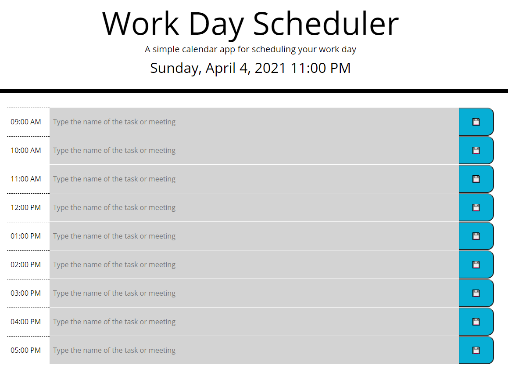

# work-day-scheduler

1. Summary:

- This project allows keeping a simple agenda for the meetings or tasks of the day. It is set for a regular work shift of 9 AM to 6 PM, being the 5 PM time slot the last work hour of the day.

2. Functionality:

- The slots where the user can type the name of the tasks or meetings will change color depending on the current time, indicating if the time slots are in the past (gray - default), present (red), or future (green).

- The code updates the current time of the day every 200 milliseconds, and if there is a change of hour, it will apply the corresponding CSS classes to change the colors as needed. To ensure a smooth user experience, in all intervals, the code checks what the CSS classes applied are correct, and if not change is required, the code will not change the classes or re-apply them.

- The user can save the information typed in the time slots by clicking on the save buttons to record the information in the local storage.

- If the user wants to clear the information in a time slot, they can delete the content and click the save button.

- In the header section of the web page, the user will see the current date and time for reference.

2. Image:

